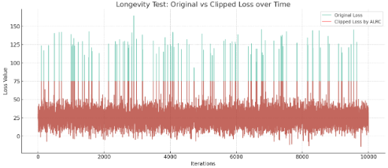

# ALRC
Implementation of Adaptive Learning Rate Clipping by Ede et al
https://doi.org/10.1088/2632-2153/ab81e2

The official implementation is in TensorFlow, I have rewritten their implementation in PyTorch using only PyTorch functions.
https://github.com/Jeffrey-Ede/ALRC

Code was originally written to stabilise training with massive models and therefore small batch sizes for my thesis project: Paired Diffusion: Generation of 2D and 3D aligned, synthetic PET-CT-Segmentation scans using Linked Denoising Diffusion Probabilistic Models

## Testing
Simple tests to show the functionality of the implementation.

### 1. Normal distribution of values with outliers appended.
```python
losses = np.random.normal(25, 10, 1000)
outliers = np.array([100, 150, 200])
```
Clipped losses:<br>


### 2. Showing the clipping of outliers over a long period
Loss values again generated from random normal distribution with several outliers placed at random intervals
```python
losses = np.random.normal(25, 10, 10000)
outliers = np.random.choice(np.arange(len(long_sequence_losses)), size=100, replace=False)
losses[outlier_indices] = losses[outlier_indices] + 100
```
Longevity test:<br>


Additional simple testing confirms the function does not adjust negative, zero or constant losses.

## Usage

Usage is simple

1. Import into your script and make an ALRC object

```python
from alrcpytorch import ALRC
alrc = ALRC()
```

2. Use it to clip losses in your training loop

```python
...
loss = alrc(loss)
loss.backward()
...
```

More advanced, parameter values can be tuned in the original file. Specifically, a prediction for the starting mu1 and mu2 is useful, but it is very robust. See the original implementation for more details.
